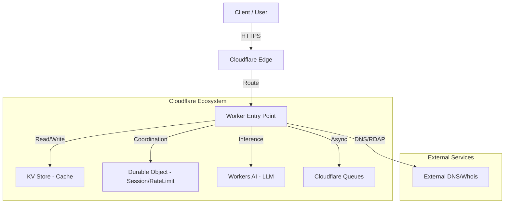
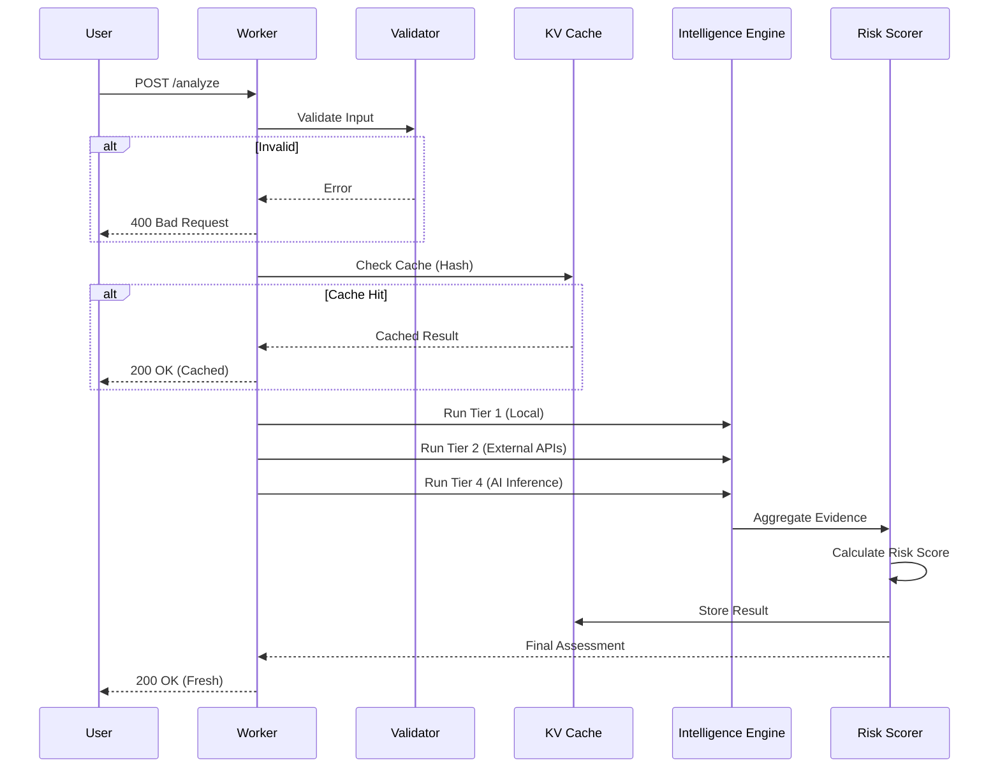

# Architecture - Cloudflare-Native Cyber Intelligence Platform

## System Context

## Data Flow

## Disclaimer
This system implements defense-in-depth controls. Security is a continuous process requiring regular updates, threat modeling, and incident response capabilities. No system is impervious to determined adversaries.
